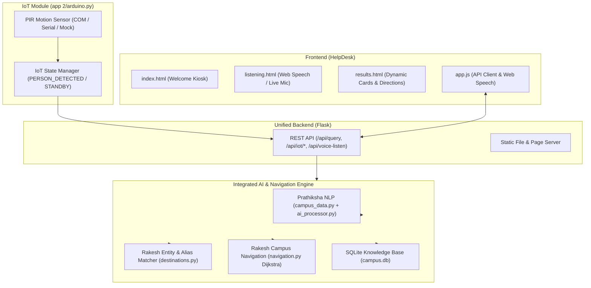

# Bhandarkars' Arts & Science College · Smart AI Voice Help Desk & Navigation Kiosk

An integrated, voice-enabled intelligent campus help desk and navigation kiosk developed for **Bhandarkars' Arts & Science College (BASCK), Kundapura**.

This system unifies:
1. **Frontend**: Modern web kiosk interface with real-time in-browser Web Speech recognition, dynamic result cards, step-by-step turn directions, and SpeechSynthesis voice readout.
2. **Backend & IoT**: Flask REST API server, SQLite campus knowledge base (`campus.db`), and cross-platform Arduino PIR motion sensor integration.
3. **AI NLP & Navigation**: Dijkstra shortest-path pathfinding, entity extraction with alias & typo tolerance, multi-stop routing, and natural language query understanding.

---

## 🏛️ System Architecture



---

## 🚀 Quickstart

### 1. Prerequisites
- Python 3.8+ installed on your system.
- Modern Web Browser (Google Chrome, Microsoft Edge, Safari) with microphone access enabled.

### 2. Install Dependencies
```bash
pip install -r requirements.txt
```

### 3. Launch the Integrated Kiosk
Run the single root entry point:
```bash
python run.py
```

The system will:
- Verify and auto-seed the SQLite database (`campus.db`).
- Start the background IoT PIR motion sensor monitor.
- Launch the Flask server at **`http://127.0.0.1:5000/`**.
- Automatically open your default browser to the Kiosk welcome screen.

---

## 📁 Repository Structure

```text
HelpDesk_Final/
├── run.py                                     # Unified root application launcher
├── requirements.txt                           # Project dependencies
├── core/
│   ├── __init__.py
│   └── integration_engine.py                  # Core engine combining NLP, Dijkstra & SQLite
├── tests/
│   └── test_integration.py                   # Automated end-to-end integration tests
│
├── HelpDesk/                                  # Frontend Web Kiosk
│   ├── index.html                             # Kiosk Welcome Screen
│   ├── listening.html                         # Real-time Voice Listening Stage
│   ├── results.html                           # Dynamic Result Cards & Directions
│   ├── style.css                              # Responsive styles, glassmorphism & animations
│   ├── app.js                                 # Web Speech API, API client, IoT poller
│   ├── bcklogo.png                            # College emblem
│   └── bckimg.jpg                             # Campus background
│
├── app/                                       # Backend & IoT
│   ├── app.py                                 # Flask REST API server
│   ├── arduino.py                             # Arduino PIR motion sensor integration
│   ├── campus.db                              # SQLite campus knowledge base
│   ├── databasse.py                           # Database schema and initial data seeder
│   └── __init__.py                            # Python package marker
│
└── Group4_AI_Voice_Navigation/                # AI NLP & Voice Navigation
    ├── Prathiksha_AI_NLP/
    │   ├── ai_processor.py                    # NLP intent and keyword scoring
    │   ├── campus_data.py                     # Campus information mappings
    │   └── test_ai.py                         # NLP test script
    └── Rakesh_Voice_Navigation/
        ├── navigation.py                      # Dijkstra shortest path & step directions
        ├── destinations.py                    # Entity extraction, aliases & typo fuzzy matching
        ├── intent.py                          # Navigation vs informational intent detection
        ├── voice.py                           # Microphone STT (Google Speech Recognition)
        ├── tts.py                             # Offline Text-to-Speech voice engine
        └── test_navigation.py                 # Navigation unit tests
```

---

## 🎤 Features & How It Works

### 1. Hands-Free Voice Recognition
- **Browser-Native Web Speech API**: Instant speech-to-text directly in the browser with live transcript preview without compiling external audio binaries.
- **Hardware Kiosk Mic Fallback**: Optional button on `listening.html` to trigger server-side microphone recording via `voice.py` (`SpeechRecognition`).
- **Text Input Fallback**: Visitors can type queries on `listening.html` if no microphone is available or permitted.

### 2. Intelligent Routing & Pathfinding (Dijkstra Algorithm)
- Calculates optimal walking routes from the Kiosk (default: **Admin Block**) to any campus destination.
- Supports **multi-destination itineraries** (e.g., *"Where is the library and canteen?"*).
- Supports **custom origin points** (e.g., *"From canteen to library"*).
- Provides exact walking distance (meters), estimated walking time (minutes), and turn-by-turn walking steps.

### 3. Comprehensive Campus Knowledge Base (SQLite)
Answers queries across:
- **Locations & Labs**: BCA Labs 1-5, PUC Lab, Canteen, Hostels, Sports Complex, Parking.
- **Academic Departments**: BCA, Chemistry, Physics, Botany, Zoology, Kannada, BM, Hindi, Sanskrit, Mathematics, etc.
- **Administrative Offices**: Principal's Chamber, Fee Payment, Admissions, Scholarship Help, Student Service Centre.
- **Timings**: Library hours (weekday vs Saturday), Office working hours, Class schedules.
- **Admissions & Courses**: Undergraduate degrees (BA, BSc, BCom, BBA, BCA) and application steps.
- **Emergency Services**: Security booth, Ambulance, Hospital, and direct emergency helplines.

### 4. IoT PIR Presence Detection
- The kiosk connects to an Arduino with a PIR motion sensor.
- When a visitor approaches, the sensor sends `PERSON_DETECTED`, prompting the kiosk to play a spoken welcome greeting.
- When idle, `NO_PERSON` puts the kiosk in standby mode.
- If physical Arduino hardware is not connected, the system automatically runs in **simulation mode** without throwing errors.

---

## 🔌 REST API Endpoints

| Method | Endpoint | Description |
|---|---|---|
| `POST` | `/api/query` | Submit natural language query `{ "query": "Where is the library?" }` |
| `GET` | `/api/iot/status` | Read current PIR sensor status (`STANDBY` or `WELCOME`) |
| `POST` | `/api/iot/trigger` | Manually simulate PIR event `{ "message": "PERSON_DETECTED" }` |
| `GET` | `/api/destinations` | List all canonical campus landmarks and aliases |
| `GET` | `/api/health` | Check database, engine, and IoT module health |
| `POST` | `/api/voice-listen` | Trigger server hardware microphone recording |
| `GET` | `/search/<keyword>` | Full-text search across SQLite database tables |
| `GET` | `/location/<name>` | Fetch specific location or department details |
| `GET` | `/timing/<name>` | Fetch operating hours for facility |
| `GET` | `/emergency` | List all emergency contacts |

---

## 🧪 Running Automated Tests

Run the comprehensive integration test suite:
```bash
python -m unittest tests/test_integration.py
```

Run individual module tests:
```bash
# Test Dijkstra navigation engine
python Group4_AI_Voice_Navigation/Rakesh_Voice_Navigation/test_navigation.py

# Test Prathiksha AI NLP intent engine
python Group4_AI_Voice_Navigation/Prathiksha_AI_NLP/test_ai.py
```

---

## 🛠️ Arduino Hardware Wiring (Optional)

```text
[Arduino Uno]
  5V  ─────────────── VCC (PIR Sensor)
  GND ─────────────── GND (PIR Sensor)
  Pin 2 ───────────── OUT (PIR Sensor Digital Signal)
```

Example Arduino Sketch:
```cpp
const int PIR_PIN = 2;
int lastState = LOW;

void setup() {
  Serial.begin(9600);
  pinMode(PIR_PIN, INPUT);
}

void loop() {
  int currentState = digitalRead(PIR_PIN);
  if (currentState == HIGH && lastState == LOW) {
    Serial.println("PERSON_DETECTED");
    lastState = HIGH;
    delay(2000);
  } else if (currentState == LOW && lastState == HIGH) {
    Serial.println("NO_PERSON");
    lastState = LOW;
    delay(1000);
  }
  delay(100);
}
```
